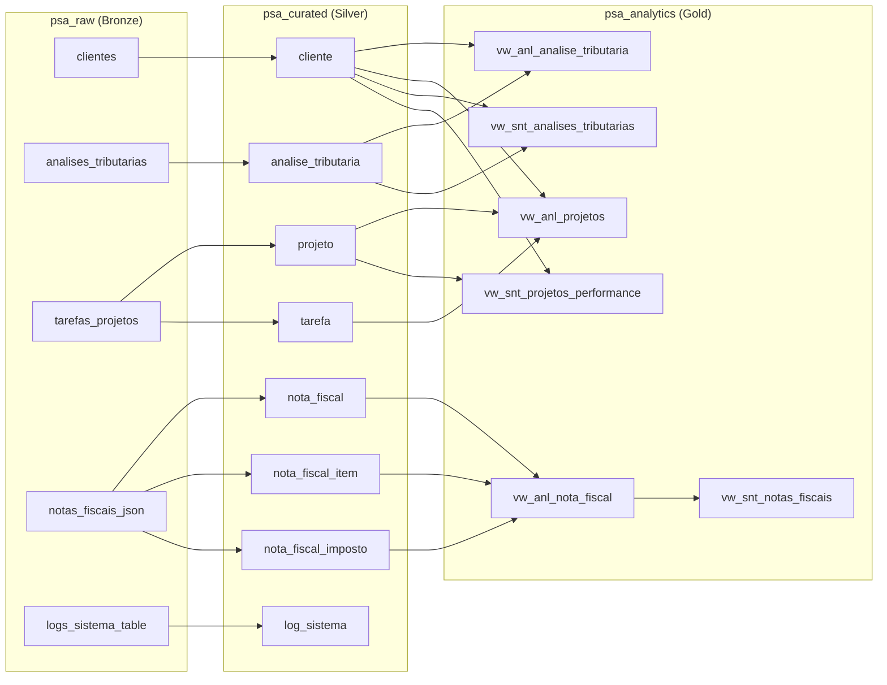
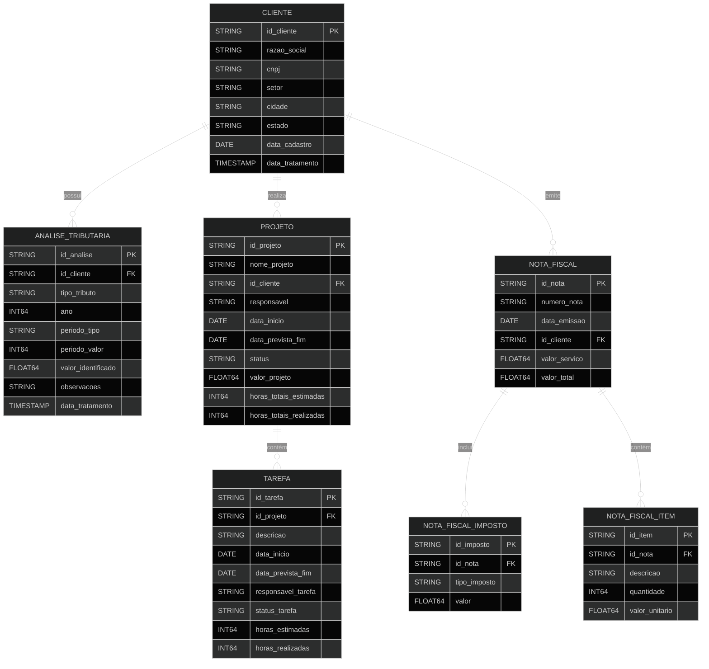

# Teste Engenheiro de Dados

## Visão geral da solução

Este projeto implementa um **pipeline de ingestão e modelagem de dados no BigQuery**, estruturado em três camadas: **Bronze (psa_raw)**, **Silver (psa_curated)** e **Gold (psa_analytics)**.

### Fluxo de funcionamento

1. **Ingestão Raw (Bronze)**  
   O script `scripts/pipeline_ingestao.py` lê os arquivos brutos localizados em `dados/` (`.csv`, `.json`, `.xml`, `.txt`) e realiza o carregamento para tabelas `psa_raw.*` no BigQuery, mantendo logs em `logs/pipeline_ingestao.csv`.

2. **Modelagem Curated (Silver)**  
   Após a ingestão, os arquivos SQL em `sql/` devem ser executados no BigQuery para criar e popular as tabelas tratadas da camada **Silver (`psa_curated`)**.  
   Essas tabelas aplicam limpeza, normalização, padronização de tipos e criação de chaves primárias e estrangeiras.

3. **Modelagem Analytics (Gold)**  
   As views analíticas são criadas diretamente no BigQuery, na camada **Gold (`psa_analytics`)**, consolidando informações das tabelas tratadas e fornecendo bases para relatórios e dashboards analíticos.

4. **Views de Qualidade de Dados (Quality)**  
   As views responsáveis por monitorar e validar a integridade das tabelas estão na camada **Quality (`psa_quality`)**, que centraliza métricas e verificações de consistência entre as camadas Bronze e Silver.

5. **Execução do pipeline**  
   ```bash
   python scripts/pipeline_ingestao.py
   ```
   Após o carregamento:
   - Execute os scripts SQL de criação das tabelas Silver e views Gold (em um projeto novo).
   - No projeto atual, as tabelas e views já estão criadas.

---

## Preparar ambiente Python

```bash
python3 -m venv venv
source venv/bin/activate
pip install --upgrade pip
pip install -r requirements.txt
```

---

## Dependências e pré-requisitos

- Python 3.10+ (o projeto usa 3.13 na venv local).  
- Conta de serviço com permissões de BigQuery Data Editor e BigQuery Job User.  
- Bibliotecas listadas em `requirements.txt` (pandas, google-cloud-bigquery, pandas-gbq, BeautifulSoup4, xmltodict etc.).  
- Acesso aos datasets `psa_raw` e `psa_curated` dentro do projeto `psa-data-test-476002`.  
- Dados de exemplo em `dados/` (CSV, TXT, JSON, XML e HTML) para realizar testes locais da pipeline.  

---

## Estrutura de pastas

```
.
├── dados/                  # Fontes brutas usadas pelos loaders
├── docs/                   # Espaço reservado para documentação adicional
├── logs/                   # Arquivos gerados em runtime (ex.: pipeline_ingestao.csv)
├── scripts/
│   ├── pipeline_ingestao.py   # Pipeline orientada a objetos para cargas raw/formatted
│   ├── data_loader_new.py     # Versão alternativa/experimental do loader
│   └── data_quality.sql       # Queries auxiliares de validação
├── sql/                    
│   ├── arquitetura_camadas.py   # Arquivo com os scripts de criação das tabelas nivel silver
│   ├── ddl_bronze_scripts.py    # Arquivo com as tabelas nivel bronze
│   └── queries_otimizadas.sql   # Views analiticas e sintéticas da camada gold
└── requirements.txt        # Dependências Python alinhadas ao GCP
```

---

## Linhagem de Dados (Bronze → Gold)



---

## Diagrama ER – Camada Silver (`psa_curated`)



---

## Próximos passos e melhorias sugeridas

- **Orquestração/Agendamento:** integrar a pipeline no Apache Airflow ou pelo Google Cloud.  
- **Testes automatizados:** adicionar testes unitários para os loaders e mocks do BigQuery, além de smoke tests SQL (`bq dry-run`) em CI.  
- **Observabilidade expandida:** integrar o log CSV com Cloud Logging/Monitoring e alertas para falhas críticas nos loaders ou checagens de qualidade.  
